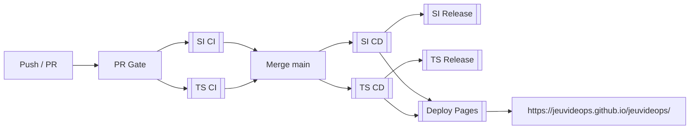

<div align="center">
  

  <h1>Jeux VideOPS</h1>

  <p>
    <strong>Automatiser plus pour travailler moins, et livrer plus surement.</strong><br>
    Projet DevOps / DevSecOps realise dans le cadre de W-DOP-200 (Web@cadémie Epitech Paris).
  </p>

  <a href="https://github.com/jeuvideops/jeuvideops/actions/workflows/pr-gate.yml">
    
  </a>
  <a href="https://github.com/jeuvideops/jeuvideops/actions/workflows/deploy-pages.yml">
    
  </a>
  <a href="https://github.com/jeuvideops/jeuvideops/actions/workflows/ci-space-invaders.yml">
    
  </a>
  <a href="https://github.com/jeuvideops/jeuvideops/actions/workflows/ci-two-spaceships.yml">
    
  </a>

  <p>
    <a href="https://jeuvideops.github.io/jeuvideops/">Voir la plateforme GitHub Pages</a>
  </p>

  
</div>

---

## Presentation (version courte)

**Jeux VideOPS** industrialise la livraison de deux jeux retro JavaScript:

- `SpaceInvaders`
- `TwoSpaceships`

Le depot met en place une chaine CI/CD complete avec GitHub Actions et GitHub Pages:

- CI par jeu: lint, tests unitaires, tests E2E, audit `npm`
- PR Gate sur `main` avec validation conditionnelle par jeu
- CD par jeu: build statique + images Docker (GHCR + DockerHub)
- release automatisee: tags semver, changelog, artefacts
- dashboard web centralise pour jouer et consulter les rapports

---

## Pipeline en bref



---

## Conformite W-DOP-200

- workflows manuels (`workflow_dispatch`) + automatiques (`push`, `pull_request`, `workflow_run`)
- au moins 2 jeux couverts par CI/CD
- lint Google style (`eslint-config-google` / ESLint)
- tests unitaires + tests fonctionnels Playwright
- annotations/feedback CI + rapports artefacts (coverage, e2e, allure, audit)
- audit securite des dependances (`npm audit`)
- deploiement web via GitHub Pages
- bonnes pratiques DevSecOps: secrets/variables GitHub, rulesets, GitHub App de release

---

## Quick Start

```bash
git clone git@github.com:jeuvideops/jeuvideops.git
cd jeuvideops
```

### SpaceInvaders

```bash
cd SpaceInvaders
npm ci
npm run dev
```

### TwoSpaceships

```bash
cd TwoSpaceships
npm ci
npm run dev
```

---

## Structure rapide

```text
jeuvideops/
├── .github/workflows/      # CI, CD, PR Gate, Release, Pages
├── .github/actions/        # Actions composites reutilisables
├── .github/pages/          # Dashboard web central
├── SpaceInvaders/          # Jeu 1 + tests + Dockerfile
└── TwoSpaceships/          # Jeu 2 + tests + Dockerfile
```

---

## Equipe

- [Sofian B.](https://github.com/Sofian-bll)
- [Hugo](https://github.com/Kvrmea)

## Liens

- Repo: https://github.com/jeuvideops/jeuvideops
- Actions: https://github.com/jeuvideops/jeuvideops/actions
- Releases: https://github.com/jeuvideops/jeuvideops/releases
- Pages: https://jeuvideops.github.io/jeuvideops/
